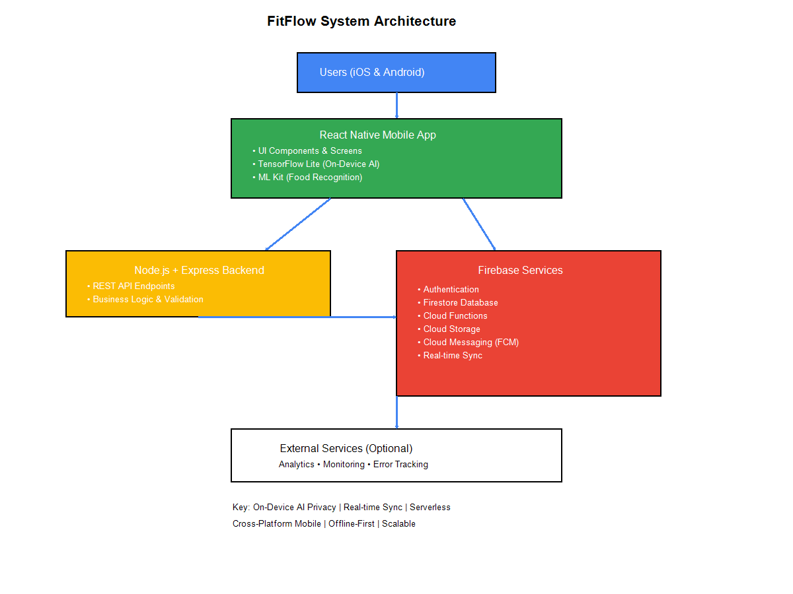

# FitFlow Redesign



## Project Overview

FitFlow is a comprehensive fitness tracking mobile application being redesigned to address critical user retention and engagement challenges. This redesign focuses on delivering personalized workout experiences, enhanced social engagement, streamlined nutrition tracking, and intelligent motivation systems powered by AI and machine learning.

## Problem Statement

User research and analytics revealed several critical issues with the original FitFlow application:

- **Generic Workout Plans**: Users received one-size-fits-all workout recommendations that didn't adapt to their fitness levels, goals, or progress
- **Social Isolation**: Lack of community features led to reduced motivation and accountability
- **Difficult Daily Tracking**: Cumbersome workout and nutrition logging resulted in poor user engagement
- **Nutrition Logging Friction**: Manual food entry was time-consuming and error-prone, leading to incomplete tracking
- **Lack of Motivation**: Absence of gamification, challenges, and progress visualization reduced long-term engagement
- **Poor Personalization**: Limited adaptation to user preferences, schedules, and feedback

These issues contributed to low user retention rates and decreased daily active users, necessitating a comprehensive redesign approach.

## Project Objectives

1. **Increase User Retention**: Implement AI-driven personalization to keep users engaged long-term
2. **Enhance Personalization**: Deliver adaptive workout plans that evolve with user progress
3. **Build Social Community**: Create features for sharing achievements, participating in challenges, and connecting with friends
4. **Streamline Nutrition Tracking**: Introduce camera-based food recognition to reduce manual entry friction
5. **Boost Motivation**: Implement gamification, progress visualization, and achievement systems
6. **Ensure Privacy & Security**: Provide granular privacy controls and secure data handling
7. **Improve Accessibility**: Support diverse user needs with comprehensive accessibility features
8. **Enable Offline Functionality**: Allow core features to work without constant internet connectivity

## Key Features

### 🤖 AI-Powered Personalization
- Intelligent workout plan generation based on fitness level, goals, and equipment availability
- Adaptive difficulty adjustment based on user performance and feedback
- On-device machine learning using TensorFlow Lite for privacy-focused personalization

### 📊 Comprehensive Progress Tracking
- Detailed workout logging with exercise history
- Visual progress charts and statistics
- Body measurement tracking
- Personal records and milestone achievements

### 🏆 Social Community & Challenges
- Share workout achievements with friends and community
- Participate in fitness challenges with leaderboards
- Join interest-based fitness groups
- Real-time activity notifications powered by Firebase

### 🍎 Smart Nutrition Tracking
- Camera-based food recognition using ML Kit
- Automatic calorie and macro calculation
- Meal planning and recipe suggestions
- Integration with workout plans for holistic health tracking

### 🎯 Motivation Systems
- Achievement badges and rewards
- Streak tracking and reminders
- Progress milestones and celebrations
- Personalized motivational messages

### 🔒 Privacy & Security
- Granular privacy controls for social sharing
- Secure authentication via Firebase
- On-device AI processing for sensitive data
- GDPR and privacy regulation compliance

### ♿ Accessibility Support
- Screen reader compatibility
- High contrast modes
- Adjustable text sizes
- Voice control integration

### 📱 Offline Capabilities
- Core workout tracking without internet
- Local data synchronization
- Cached workout plans and content

## Target Users

- **Fitness Beginners**: Individuals starting their fitness journey needing guidance and motivation
- **Intermediate Athletes**: Regular gym-goers seeking progression and variety
- **Health-Conscious Individuals**: People tracking nutrition and overall wellness
- **Social Fitness Enthusiasts**: Users motivated by community and challenges
- **Time-Constrained Professionals**: Busy individuals needing efficient, adaptive workouts

## Technology Stack

| Layer | Technology | Purpose |
|-------|-----------|---------|
| **Frontend** | React Native | Cross-platform mobile application (iOS & Android) |
| **Backend** | Node.js + Express | RESTful APIs and server-side business logic |
| **Real-time Services** | Firebase | Real-time notifications, social features, and messaging |
| **AI/ML** | TensorFlow Lite | On-device personalization and workout recommendations |
| **Computer Vision** | ML Kit | Camera-based food recognition for nutrition tracking |
| **Database** | Firebase/Firestore | NoSQL database for flexible data storage |
| **Authentication** | Firebase Authentication | Secure user authentication and authorization |
| **Cloud Services** | Firebase Cloud Functions | Serverless backend logic and triggers |

**Rationale**: This stack was selected for rapid cross-platform development, real-time capabilities, robust AI/ML integration, cost-effectiveness, and strong privacy features. See detailed analysis in [docs/tech-stack-summary.md](docs/tech-stack-summary.md) and [docs/decision-matrix.md](docs/decision-matrix.md).

## System Architecture

The FitFlow redesign follows a modern mobile-first architecture with clear separation of concerns:

```
User
  ↓
React Native Mobile App
  ↓
Node.js + Express Backend API
  ↓
Firebase Services (Auth, Firestore, Cloud Functions)
  ↓
External Services (ML Kit, TensorFlow Lite)
```

For detailed architecture documentation, see [docs/architecture.md](docs/architecture.md).

## Repository Structure

```
fitflow-redesign/
├── frontend/              # React Native mobile application
│   ├── src/
│   │   ├── components/   # Reusable UI components
│   │   ├── screens/      # Application screens/pages
│   │   ├── navigation/   # Navigation configuration
│   │   ├── services/     # API and service integrations
│   │   ├── hooks/        # Custom React hooks
│   │   ├── utils/        # Utility functions
│   │   └── assets/       # Images, fonts, and static files
│   ├── android/          # Android-specific configuration
│   ├── ios/              # iOS-specific configuration
│   └── package.json
│
├── backend/              # Node.js + Express backend
│   ├── src/
│   │   ├── controllers/  # Request handlers
│   │   ├── routes/       # API route definitions
│   │   ├── middleware/   # Express middleware
│   │   ├── services/     # Business logic services
│   │   ├── models/       # Data models
│   │   ├── config/       # Configuration files
│   │   └── utils/        # Utility functions
│   ├── tests/            # Backend tests
│   └── package.json
│
├── ai-service/           # AI/ML services
│   ├── models/           # TensorFlow models
│   ├── services/         # ML service implementations
│   ├── utils/            # ML utilities
│   └── tests/            # ML service tests
│
├── docs/                 # Project documentation
│   ├── tech-stack-summary.md
│   ├── technology-comparison.md
│   ├── decision-matrix.md
│   ├── architecture.md
│   ├── ADR-001-technology-stack.md
│   └── architecture-diagram.png
│
├── .github/
│   └── workflows/        # CI/CD pipelines
│
├── README.md
├── .gitignore
└── LICENSE
```

## Installation Instructions

### Prerequisites

- **Node.js** (v18 or higher)
- **npm** or **yarn**
- **React Native CLI**: `npm install -g react-native-cli`
- **Android Studio** (for Android development)
- **Xcode** (for iOS development, macOS only)
- **Firebase Account** with project created

### Frontend Setup

```bash
cd frontend
npm install

# iOS-specific (macOS only)
cd ios
pod install
cd ..

# Run on iOS
npm run ios

# Run on Android
npm run android
```

### Backend Setup

```bash
cd backend
npm install

# Configure environment variables
cp .env.example .env
# Edit .env with your Firebase credentials and configuration

# Run in development mode
npm run dev

# Run in production mode
npm start
```

### Firebase Configuration

1. Create a Firebase project at [Firebase Console](https://console.firebase.google.com/)
2. Enable Authentication, Firestore, and Cloud Functions
3. Download configuration files:
   - `google-services.json` for Android → `frontend/android/app/`
   - `GoogleService-Info.plist` for iOS → `frontend/ios/`
4. Add Firebase configuration to backend `.env` file

### AI/ML Service Setup

```bash
cd ai-service
pip install -r requirements.txt

# Download pre-trained models
python scripts/download_models.py

# Run ML service
python main.py
```

## Running the Application

### Development Mode

```bash
# Terminal 1: Start backend
cd backend
npm run dev

# Terminal 2: Start React Native metro bundler
cd frontend
npm start

# Terminal 3: Run on device/emulator
npm run ios    # iOS
npm run android # Android
```

### Production Build

```bash
# Android
cd frontend/android
./gradlew assembleRelease

# iOS
cd frontend/ios
xcodebuild -workspace FitFlow.xcworkspace -scheme FitFlow -configuration Release
```

## Testing Instructions

### Frontend Tests

```bash
cd frontend
npm test                 # Run all tests
npm run test:watch      # Watch mode
npm run test:coverage   # With coverage report
```

### Backend Tests

```bash
cd backend
npm test                 # Run all tests
npm run test:integration # Integration tests only
npm run test:coverage   # With coverage report
```

### End-to-End Tests

```bash
cd frontend
npm run e2e:ios         # iOS E2E tests
npm run e2e:android     # Android E2E tests
```

## Security Considerations

- **API Security**: All API endpoints require authentication tokens
- **Data Encryption**: Sensitive data encrypted at rest and in transit
- **Firebase Security Rules**: Strict read/write rules implemented
- **Environment Variables**: Never commit `.env` files or API keys
- **Input Validation**: All user inputs sanitized and validated
- **Rate Limiting**: API rate limiting to prevent abuse
- **Privacy by Design**: Minimal data collection with user consent
- **OWASP Compliance**: Following OWASP Mobile Security guidelines

## Improvements Identified Through Usability Testing

Based on user testing sessions, the following improvements were implemented:

1. **Enhanced AI Control**: Users can now easily adjust AI recommendations and provide feedback
2. **Simplified Social Navigation**: Streamlined access to community features and challenges
3. **Improved Onboarding**: Clearer guidance for new users with progressive feature introduction
4. **Better Visual Hierarchy**: Enhanced UI/UX with clear information architecture
5. **Accessibility Enhancements**: Improved screen reader support and contrast ratios
6. **Offline Indicators**: Clear messaging when features require connectivity

## Future Improvements

- **Wearable Integration**: Apple Watch, Fitbit, and Garmin synchronization
- **Advanced Analytics**: Detailed performance insights and trend analysis
- **Video Exercise Demos**: Integration of exercise demonstration videos
- **Personal Trainer Chat**: AI-powered form correction and guidance
- **Meal Delivery Integration**: Partnership with meal prep services
- **Recovery Tracking**: Sleep, stress, and recovery monitoring
- **Multi-language Support**: Internationalization for global reach

## Development Team

**Project Type**: Academic HCI Case Study - SLIIT Information Technology  
**Course**: Human-Computer Interaction  
**Activity**: Activity 5 - Technology Stack Selection  
**Academic Year**: 2026

## Documentation

- [Technology Stack Summary](docs/tech-stack-summary.md)
- [Technology Comparison Analysis](docs/technology-comparison.md)
- [Weighted Decision Matrix](docs/decision-matrix.md)
- [System Architecture](docs/architecture.md)
- [Architecture Decision Record](docs/ADR-001-technology-stack.md)

## Contributing

This is an academic project. For development team members:

1. Create a feature branch: `git checkout -b feature/your-feature-name`
2. Commit changes: `git commit -m 'Add some feature'`
3. Push to branch: `git push origin feature/your-feature-name`
4. Open a Pull Request for review

## License

This project is licensed under the MIT License - see the [LICENSE](LICENSE) file for details.

---

**Note**: This is a student project developed as part of an HCI case study. The technology selections and architectural decisions are based on analysis of real-world fitness application requirements and best practices in mobile application development.
